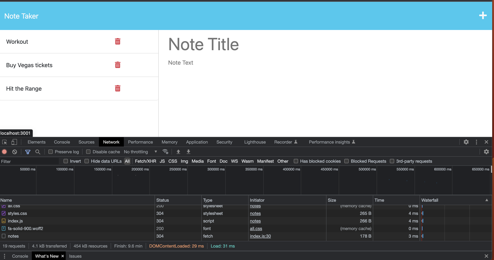

# Note Taker Starter Code

## Description

FullStack application that uses Express.js to connect the backend. On the fontend it uses bootstrap CDN and CSS stylesheet.

Deployed on Heroku: https://notetakerexpressv2.herokuapp.com/notes

## Table of Contents

- [License](#License)
- [Links](#Links)
- [Credits](#Credits)
- [Future](#Future)
- [Contact](#Contact)

## License

License: MIT License

## Links

Github: https://github.com/escotoj/NoteTakerExpress.js 

Screenshot of deployed app with zero errors. 

## Credits

Jose Escoto, Full Stack Development Student, University of Berkeley.
Jacob Nolan, Tutor

## Contact
For more questions please contact below:
Email: j.escoto@gmail.com
GitHub: escotoj
